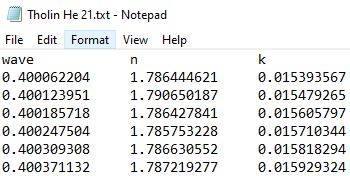
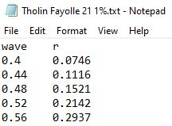

## Multi-Composite Modeling UI
Updated: 2021.18.11

Beta 1.0 now available for testing: [Multi-Composite Spectra Modeling UI](https://share.streamlit.io/karnegre/dragonfly_compmodeling_ui/main/app.py).

The user-interface (UI) was developed using Streamlit. The UI is intended for [Dragonfly](https://dragonfly.jhuapl.edu/) team use as a modeling aid for determining the surface composition of Saturn's moon, Titan. 

Models used include an intimate mixing model using the [Shkuratov model](https://www.sciencedirect.com/science/article/pii/S0019103598960353) and a linear mixing model using compound reflectance spectra.

## Installation

**Note: You only need to install Dragonfly_CompModeling_UI if you want to contribute or run it 
locally. If you just want to use it, go [here](https://share.streamlit.io/karnegre/dragonfly_compmodeling_ui/main/app.py).**

```bash
git clone https://github.com/karnegre/Dragonfly_CompModeling_UI.git
cd Dragonfly_CompModeling_UI
pip install -r requirements.txt
```
## Running locally

```bash
streamlit run app.py
```
## Using the Models
The app contains two different models for creating multi-composite spectra: Optical Constant (OC) model and Reflectance Spectra (RS) model. The following steps are how-tos for using them:
### Optical Constant Modeling
1. In App Navigation, select the *Optical Constant Modeling* tab
2. Select compounds for the mixture (up to five compounds)
- First select grouping (Ice, Organic, Oceanic, Tholin, Higher Order Organic)
- Then, select desired compound.
    - Tabled library information for compounds will pop up upon selection  
3. Select number of multi-composite spectra (up to five spectrum)
4. Edit **each** spectrum to input model parameters:
- Grain size for each compound (grain size is currently constant for all spectra)
    - Inputted parameters presented in left-hand table : *Grain Size Table*
- Concentration amount for each compound
    - Inputted parameters presented in right-hand table : *Compound Concentration Table*
5. Once all spectra parameters inputted, click *Start Calculations*
- Multi-composite spectra plots generated
- Download data as CSV option avaliable 
6. To create another set of spectra using this model, **you must** click on *Restart OC Modeling*

### Reflectance Spectra Modeling
1. In App Navigation, select the *Reflectance Spectra Modeling* tab
2. Select compounds for the mixture (up to five compounds)
- First select grouping (Ice, Organic, Oceanic, Tholin, Higher Order Organic)
- Then, select desired compound.
    - Tabled library information for compounds will pop up upon selection  
3.  Input model parameters:
- Concentration amount for each compound
    - Inputted parameters presented in the table : *Model Spectrum Parameters*
5. Once spectrum parameters inputted, click *Start Calculations*
- Multi-composite spectra plots generated
- Download data as CSV option avaliable 
6. To create another set of spectra using this model, **you must** click on *Restart RS Modeling*

## Instructions for Uploading Data
There are two sets of instructions for prepping the data; one for uploading optical constant data and the other for reflectance spectra data
### Data Preparation
1. Prepping your Optical Constant Data
    - Copy and paste data into Notepad
    - **Data must be in the following format:**
   
     
   
        - wave column contains the wavelength domain (micron)
        - n column contains the refractive indexes
        - k column contains the extinction coefficients
       
    - Save the file as the name of the compound and as a .txt file
2. Prepping your Reflectance Data
    - Copy and paste data into Notepad
    - **Data must be in the following format:**
   
     
   
        - wave column contains the wavelength domain (micron)
        - r column contains the albedo 
       
    - Save the file as the name of the compound and as a .txt file
### Data Upload
Head to the app [Multi-Composite Spectra Modeling UI](https://share.streamlit.io/karnegre/dragonfly_compmodeling_ui/main/app.py) and complete the form under the Upload Data tab